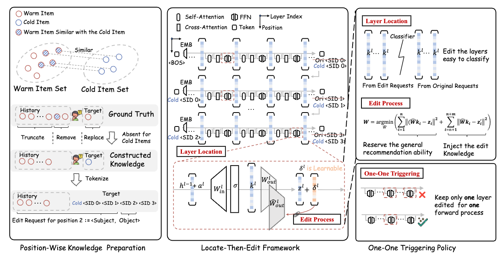
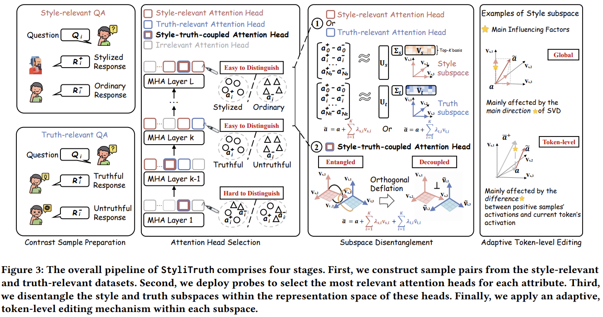
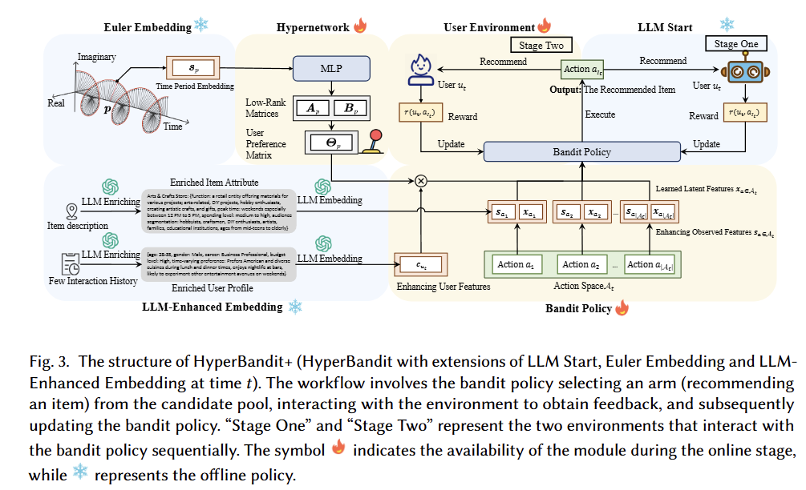
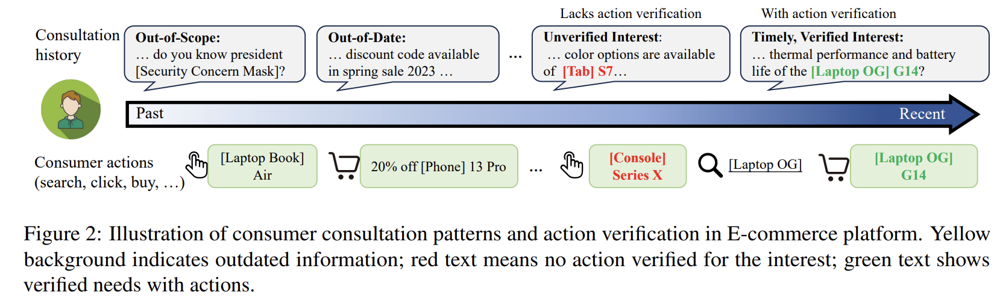
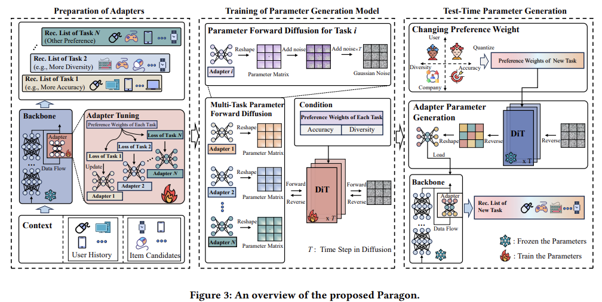
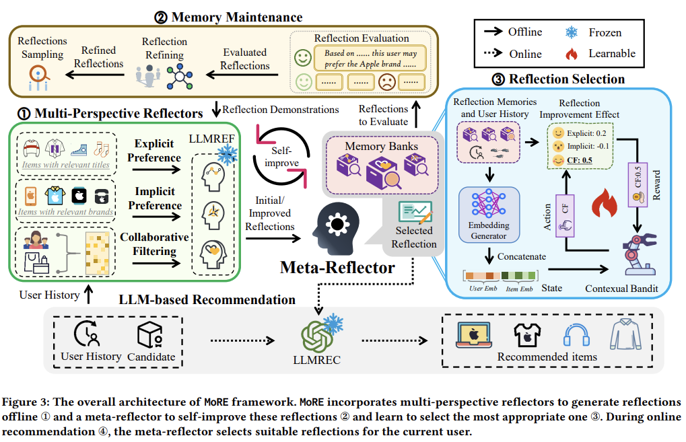
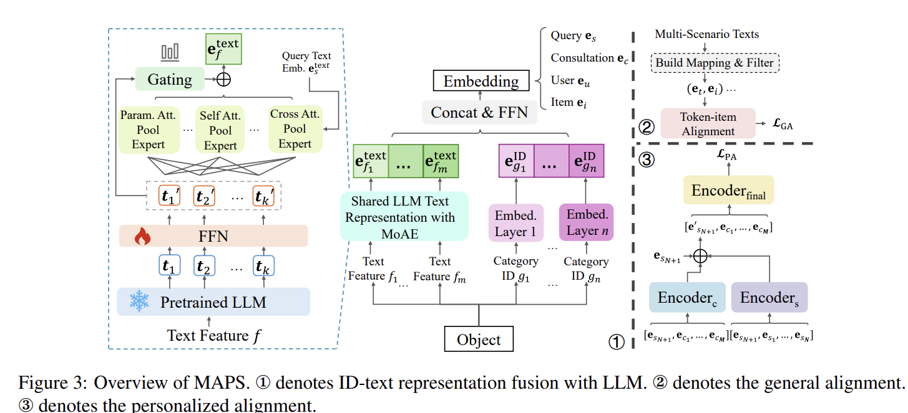
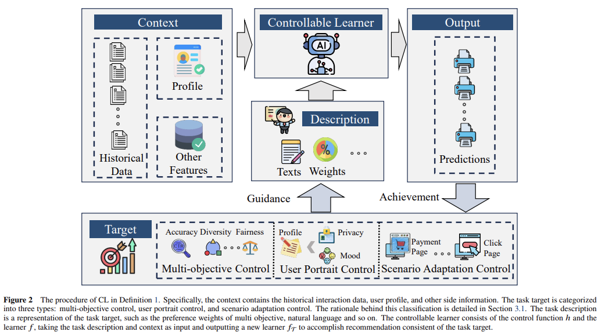
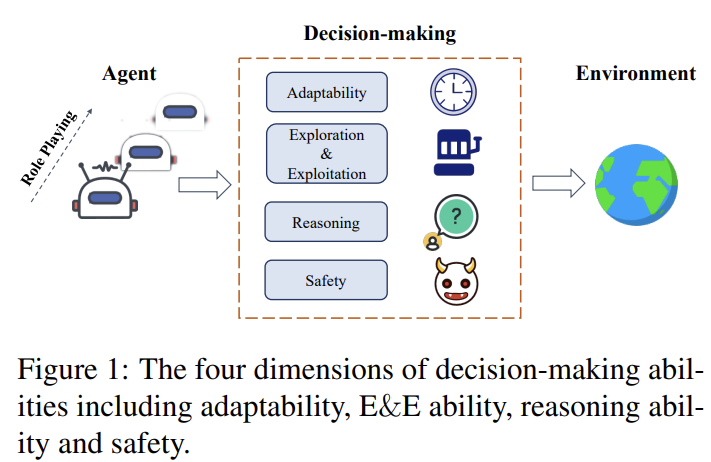
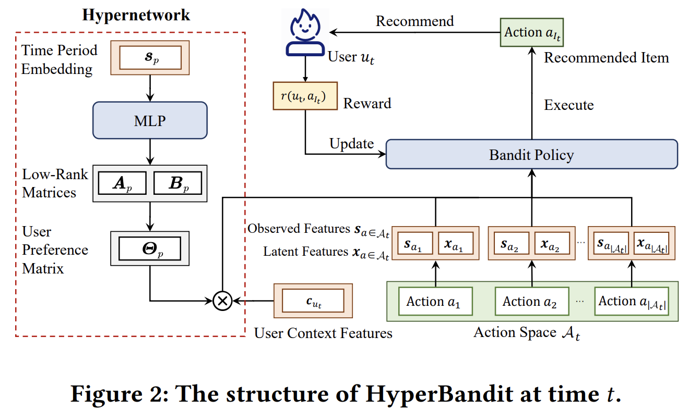








I am a second-year Ph.D. candidate at Intelligent Information Retrieval Lab ([IIR Lab](https://ruc-iir-lab.github.io/)) from the Gaoling School of Artificial Intelligence ([GSAI](http://ai.ruc.edu.cn/)), Renmin University of China ([RUC](https://www.ruc.edu.cn)), supervised by Assoc. Prof.[Xiao Zhang](https://scholar.google.com/citations?user=5FZ6wbAAAAAJ&hl=zh-CN) and Prof. [Jun Xu](https://scholar.google.com/citations?user=su14mcEAAAAJ). I obtained my bachelor’s degree from Huazhong University of Science and Technology([HUST](https://www.hust.edu.cn/)) in June 2023 and supervised by Prof. [Wei Wei](https://scholar.google.com/citations?hl=zh-CN&user=_JaPEsAAAAAJ&view_op=list_works) in Cognitive Computing and Intelligent Information Processing Laboratory ([CCIIP Lab](http://cciip.cs.hust.edu.cn/index.htm)). My research interests include Large Language Model, Recommender System.

# 🔥 News

- *2026.04*: &nbsp;🎉🎉 My first-author paper ‘‘Adapting Model Editing for Generative Recommendation with Cold-Start Items’’ is accepted by **([SIGIR 2026](https://sigir2026.org/en-AU))**! 
- *2026.01*: &nbsp;🎉🎉 My first-author paper ‘‘StyliTruth: Unlocking Stylized yet Truthful LLM Generation via Disentangled Steering’’ is accepted by **([ICLR 2026](https://iclr.cc/))**! 
- *2026.01*: &nbsp;🎉🎉 My first-author paper ‘‘Enhancing Bandit Algorithms with LLMs for Time-varying User Preferences in Streaming Recommendations’’ is accepted by **([TOIS](https://2025.emnlp.org/))**! 
- *2025.08*: &nbsp;🎉🎉 Our paper ‘‘Similarity = Value? Consultation Value Assessment and Alignment for Personalized Search’’ is accepted by **([EMNLP 2025](https://2025.emnlp.org/))**! 
- *2025.07*: &nbsp;🎉🎉 My first-author paper ‘‘A Survey of Controllable Learning: Methods and Applications in Information Retrieval and Recommender Systems’’ is selected for the **Excellent Young Computer Scientists Forum in FCS**
- *2025.06*: &nbsp;🎉🎉 My first-author paper ‘‘Paragon: Parameter Generation for Controllable Multi-Task
Recommendation’ is accepted by **([RecSys 2025](https://recsys.acm.org/recsys25/))**! 
- *2025.06*: &nbsp;🎉🎉 Our paper ‘‘Enhancing Sequential Recommendations through Multi-Perspective Reflections and Iteration’’ is accepted by **([RecSys 2025](https://recsys.acm.org/recsys25/))**! 
- *2025.06*: &nbsp;🎉🎉 My first-author paper ‘‘A Survey of Controllable Learning: Methods and Applications in Information Retrieval and Recommender Systems’’ is accepted by **([FCS](https://journal.hep.com.cn/fcs/EN/10.1007/s11704-025-41366-5))**!
- *2025.03*: &nbsp;🎉🎉 Our paper ‘‘MAPS: Motivation-Aware Personalized Search via LLM-Driven Consultation Alignment’’ is accepted by **([ACL 2025](https://2025.aclweb.org/))**!
- *2024.05*: &nbsp;🎉🎉 My first-author paper ‘‘On the Decision-Making Abilities in Role-Playing using Large Language Models’’ is accepted by **([AAAI 2025 CMASDL Workshop](https://www.is3rlab.org/aaai25-cmasdl-workshop.github.io/))**!
- *2023.08*: &nbsp;🎉🎉  My first-author paper ‘‘HyperBandit: Contextual Bandit with Hypernetwork for Time-Varying User Preferences in Streaming Recommendation’’ is accepted by **([CIKM 2023](https://uobevents.eventsair.com/cikm2023/))**!

# 📚 Publications

<table style="width:100%; border-collapse:collapse; border-spacing:0 18px; border:none; background:none;">

   <tr style="border:none; background:none;">
    <td style="width:150px; vertical-align:top; border:none!important; background:none!important;">
      
    </td>
    <td style="vertical-align:top; border:none!important; background:none!important;">
      <b>Adapting Model Editing for Generative Recommendation with Cold-Start Items</b> 
      <b><u>Chenglei Shen</u></b>, Teng Shi, Weijie Yu, Xiao Zhang, Jun Xu 
      <b>SIGIR 2026</b> | <a href="https://arxiv.org/pdf/2603.14259">Paper</a>
    </td>
  </tr>
  
   <tr style="border:none; background:none;">
    <td style="width:150px; vertical-align:top; border:none!important; background:none!important;">
      
    </td>
    <td style="vertical-align:top; border:none!important; background:none!important;">
      <b>StyliTruth: Unlocking Stylized yet Truthful LLM Generation via Disentangled Steering</b> 
      <b><u>Chenglei Shen</u></b>, Zhongxiang Sun, Teng Shi, Xiao Zhang, Jun Xu 
      <b>ICLR 2026</b> | <a href="https://arxiv.org/pdf/2508.04530?">Paper</a>
    </td>
  </tr>
  
  <tr style="border:none; background:none;">
    <td style="width:150px; vertical-align:top; border:none!important; background:none!important;">
      
    </td>
    <td style="vertical-align:top; border:none!important; background:none!important;">
      <b>Enhancing Bandit Algorithms with LLMs for Time-varying User Preferences in Streaming Recommendations</b> 
      <b><u>Chenglei Shen</u></b>, Yi Zhan, Weijie Yu, Xiao Zhang, Jun Xu 
      <b>TOIS 2026</b> |  <a href="https://dl.acm.org/doi/epdf/10.1145/3793543">Paper</a>
    </td>
  </tr>

   <tr style="border:none; background:none;">
    <td style="width:150px; vertical-align:top; border:none!important; background:none!important;">
      
    </td>
    <td style="vertical-align:top; border:none!important; background:none!important;">
      <b>Similarity = Value? Consultation Value Assessment and Alignment for Personalized Search</b> 
      Weicong Qin, Yi Xu, Weijie Yu, Teng Shi <b><u>Chenglei Shen</u></b>, Xiao Zhang, Ming He, Jianping Fan, Jun Xu 
      <b>EMNLP 2025 main</b> | <a href="https://arxiv.org/pdf/2506.14437">Paper</a>
    </td>
  </tr>

  <tr style="border:none; background:none;">
    <td style="width:150px; vertical-align:top; border:none!important; background:none!important;">
      
    </td>
    <td style="vertical-align:top; border:none!important; background:none!important;">
      <b>Paragon: Parameter Generation for Controllable Multi-Task Recommendation</b> 
      <b><u>Chenglei Shen</u></b>, Jiahao Zhao, Xiao Zhang, Weijie Yu, Ming He, Jianping Fan 
      <b>Recsys 2025</b> | <a href="https://arxiv.org/pdf/2410.10639">Paper</a>
    </td>
  </tr>

  <tr style="border:none; background:none;">
    <td style="width:150px; vertical-align:top; border:none!important; background:none!important;">
      
    </td>
    <td style="vertical-align:top; border:none!important; background:none!important;">
      <b>Enhancing Sequential Recommendations through Multi-Perspective Reflections and Iteration</b> 
      Weicong Qin, Yi Xu, Weijie Yu, <b><u>Chenglei Shen</u></b>, Xiao Zhang, Ming He, Jianping Fan, Jun Xu 
      <b>Recsys 2025</b> | <a href="https://arxiv.org/pdf/2409.06377?">Paper</a>
    </td>
  </tr>

  <tr style="border:none; background:none;">
    <td style="width:150px; vertical-align:top; border:none!important; background:none!important;">
      
    </td>
    <td style="vertical-align:top; border:none!important; background:none!important;">
      <b>MAPS: Motivation-Aware Personalized Search via LLM-Driven Consultation Alignment</b> 
      Weicong Qin, Yi Xu, Weijie Yu, <b><u>Chenglei Shen</u></b>, Ming He, Jianping Fan, Xiao Zhang, Jun Xu 
      <b>ACL 2025 main</b> | <a href="https://arxiv.org/pdf/2503.01711?">Paper</a>
    </td>
  </tr>

  <tr style="border:none; background:none;">
    <td style="width:150px; vertical-align:top; border:none!important; background:none!important;">
      
    </td>
    <td style="vertical-align:top; border:none!important; background:none!important;">
      <b>A Survey of Controllable Learning: Methods and Applications in Information Retrieval and Recommender Systems</b> 
      <b><u>Chenglei Shen</u></b>, Xiao Zhang, Teng Shi, Changshuo Zhang, Guofu Xie, Jun Xu 
      <b>FCS</b> | <b style="color:#d60000;">Excellent Young Computer Scientists Forum Paper!</b> | <a href="https://arxiv.org/pdf/2407.06083">Paper</a>
    </td>
  </tr>

  <tr style="border:none; background:none;">
    <td style="width:150px; vertical-align:top; border:none!important; background:none!important;">
      
    </td>
    <td style="vertical-align:top; border:none!important; background:none!important;">
      <b>On the Decision-Making Abilities in Role-Playing using Large Language Models</b> 
      <b><u>Chenglei Shen</u></b>, Guofu Xie, Xiao Zhang, Jun Xu 
      <b>AAAI 2025 CMASDL Workshop</b> | <a href="https://arxiv.org/pdf/2402.18807">Paper</a>
    </td>
  </tr>

  <tr style="border:none; background:none;">
    <td style="width:150px; vertical-align:top; border:none!important; background:none!important;">
      
    </td>
    <td style="vertical-align:top; border:none!important; background:none!important;">
      <b>HyperBandit: Contextual Bandit with Hypernetwork for Time-Varying User Preferences in Streaming Recommendation</b> 
      <b><u>Chenglei Shen</u></b>, Xiao Zhang, Wei Wei, Jun Xu 
      <b>CIKM 2023</b> | <a href="https://arxiv.org/pdf/2308.08497">Paper</a>
    </td>
  </tr>
</table>

# 🎖 Honors and Awards
- *2025.07* FCS Excellent Young Computer Scientists Forum (top 2).
- *2023.06* Outstanding Graduate in Huazhong University of Science and Technology.
- *2021.10* Merit Student Scholarship in Huazhong University of Science and Technology.
  
# 📖 Educations
- *2023.09 - Present*, PhD Candidate. Gaoling School of Artificial Intelligence, Renmin University of China.
- *2019.09 - 2023.06*, Bachelor. School of Computer Science and Technology, Huazhong University of Science and Technology, Wuhan.

# 📚 Academic Services
- **Program Committee / Reviewer**: CIKM 2024, CIKM 2025, AAAI 2026
- **Secondary Reviewer**: EMNLP 2024, NeurIPS 2024, ICML 2025, ACL 2025, NeurIPS 2025, TOIS

# 👩🏻‍🏫 Teaching
- *Teaching Assistant,* Ai Ethics and Safety, Spring 2025
- *Teaching Assistant,* Intelligent Information Retrieval, Fall 2024
- *Teaching Assistant,* Ai Ethics and Safety, Spring 2024
- *Teaching Assistant,* Introduction to Big Data Analytics, Renmin University of China, Fall 2023
  
# 💻 Internships
- [Lenovo](https://research.lenovo.com/), AI Research Institute, focusing on controllable recommender systems.
