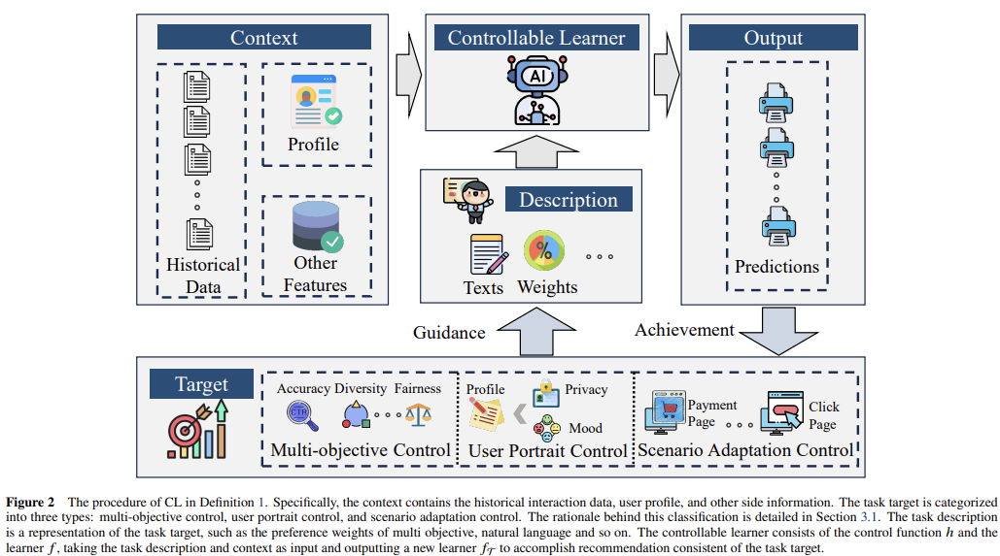








I am a second-year Ph.D. candidate at Intelligent Information Retrieval Lab ([IIR Lab](https://ruc-iir-lab.github.io/)) from the Gaoling School of Artificial Intelligence ([GSAI](http://ai.ruc.edu.cn/)), Renmin University of China ([RUC](https://www.ruc.edu.cn)), supervised by Assoc. Prof.[Xiao Zhang](https://scholar.google.com/citations?user=5FZ6wbAAAAAJ&hl=zh-CN) and Prof. [Jun Xu](https://scholar.google.com/citations?user=su14mcEAAAAJ). I obtained my bachelor’s degree from Huazhong University of Science and Technology([HUST](https://www.hust.edu.cn/)) in June 2023. My research interests include Large Language Model, Recommender System.

# 🔥 News
- *2025.07*: &nbsp;🎉🎉 My first-author paper ‘‘A Survey of Controllable Learning: Methods and Applications in Information Retrieval and Recommender Systems’’ is selected for the **Excellent Young Computer Scientists Forum in FCS**
- *2025.06*: &nbsp;🎉🎉 My first-author paper ‘‘Paragon: Parameter Generation for Controllable Multi-Task
Recommendation’ is accepted by **([RecSys 2025](https://recsys.acm.org/recsys25/))**! 
- *2025.06*: &nbsp;🎉🎉 Our paper ‘‘Enhancing Sequential Recommendations through Multi-Perspective Reflections and Iteration’’ is accepted by **([RecSys 2025](https://recsys.acm.org/recsys25/))**! 
- *2025.06*: &nbsp;🎉🎉 My first-author paper ‘‘A Survey of Controllable Learning: Methods and Applications in Information Retrieval and Recommender Systems’’ is accepted by **([FCS](https://journal.hep.com.cn/fcs/EN/10.1007/s11704-025-41366-5))**!
- *2025.03*: &nbsp;🎉🎉 Our paper ‘‘MAPS: Motivation-Aware Personalized Search via LLM-Driven Consultation Alignment’’ is accepted by **([ACL 2025](https://2025.aclweb.org/))**!
- *2024.05*: &nbsp;🎉🎉 My first-author paper ‘‘On the Decision-Making Abilities in Role-Playing using Large Language Models’’ is accepted by **([AAAI 2025 CMASDL Workshop](https://www.is3rlab.org/aaai25-cmasdl-workshop.github.io/))**!
- *2023.08*: &nbsp;🎉🎉  My first-author paper ‘‘HyperBandit: Contextual Bandit with Hypernetwork for Time-Varying User Preferences in Streaming Recommendation’’ is accepted by **([CIKM 2023](https://uobevents.eventsair.com/cikm2023/))**!

# 📝 Publications 
# 📚 Publications

  
  <b>Paragon: Parameter Generation for Controllable Multi-Task Recommendation</b> 
  <b>Chenglei Shen</b>, Jiahao Zhao, Xiao Zhang, Weijie Yu, Ming He, Jianping Fan 
  <b>Recsys 2025</b> | <a href="https://arxiv.org/pdf/2410.10639">Paper</a>

  
  <b>Enhancing Sequential Recommendations through Multi-Perspective Reflections and Iteration</b> 
  Weicong Qin, Yi Xu, Weijie Yu, <b>Chenglei Shen</b>, Xiao Zhang, Ming He, Jianping Fan, Jun Xu 
  <b>Recsys 2025</b> | <a href="https://arxiv.org/pdf/2409.06377?">Paper</a>

  
  <b>MAPS: Motivation-Aware Personalized Search via LLM-Driven Consultation Alignment</b> 
  Weicong Qin, Yi Xu, Weijie Yu, <b>Chenglei Shen</b>, Ming He, Jianping Fan, Xiao Zhang, Jun Xu 
  <b>ACL 2025</b> | <a href="https://arxiv.org/pdf/2503.01711?">Paper</a>

  
  <b>A Survey of Controllable Learning: Methods and Applications in Information Retrieval and Recommender Systems</b> 
  <b>Chenglei Shen</b>, Xiao Zhang, Teng Shi, Changshuo Zhang, Guofu Xie, Jun Xu 
  <b>FCS</b> | <b>Excellent Young Computer Scientists Forum</b> | <a href="https://arxiv.org/pdf/2407.06083">Paper</a>

  
  <b>On the Decision-Making Abilities in Role-Playing using Large Language Models</b> 
  <b>Chenglei Shen</b>, Guofu Xie, Xiao Zhang, Jun Xu 
  <b>AAAI 2025 CMASDL Workshop</b> | <a href="https://arxiv.org/pdf/2402.18807">Paper</a>

  
  <b>HyperBandit: Contextual Bandit with Hypernetwork for Time-Varying User Preferences in Streaming Recommendation</b> 
  <b>Chenglei Shen</b>, Xiao Zhang, Wei Wei, Jun Xu 
  <b>CIKM 2023</b> | <a href="https://arxiv.org/pdf/2308.08497">Paper</a>

# 🎖 Honors and Awards
- *2025.07* FCS Excellent Young Computer Scientists Forum (top 2).
- *2023.06* Outstanding Graduate in Huazhong University of Science and Technology.
- *2021.10* Merit Student Scholarship in Huazhong University of Science and Technology.
  
# 📖 Educations
- *2023.09 - Present*, PhD Candidate. Gaoling School of Artificial Intelligence, Renmin University of China.
- *2019.09 - 2023.06*, Bachelor. School of Computer Science and Technology, Huazhong University of Science and Technology, Wuhan.

# 📚 Academic Services
- **Program Committee / Reviewer**: CIKM 2024, CIKM 2025, AAAI 2026
- **Secondary Reviewer**: EMNLP 2024, NeurIPS 2024, ICML 2025, ACL 2025, NeurIPS 2025, TOIS

# 👩🏻‍🏫 Teaching
- *Teaching Assistant,* Ai Ethics and Safety, Spring 2025
- *Teaching Assistant,* Intelligent Information Retrieval, Fall 2024
- *Teaching Assistant,* Ai Ethics and Safety, Spring 2024
- *Teaching Assistant,* Introduction to Big Data Analytics, Renmin University of China, Fall 2023
  
# 💻 Internships
- [Lenovo](https://research.lenovo.com/), AI Research Institute, focusing on controllable recommender systems.
